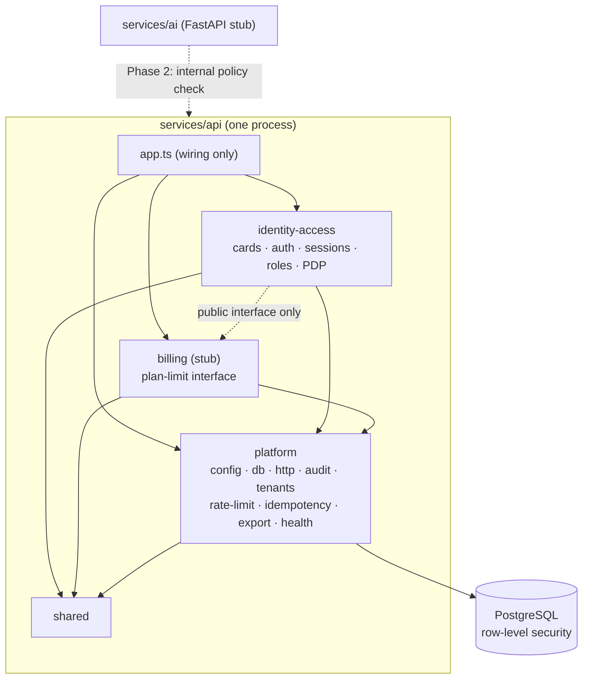
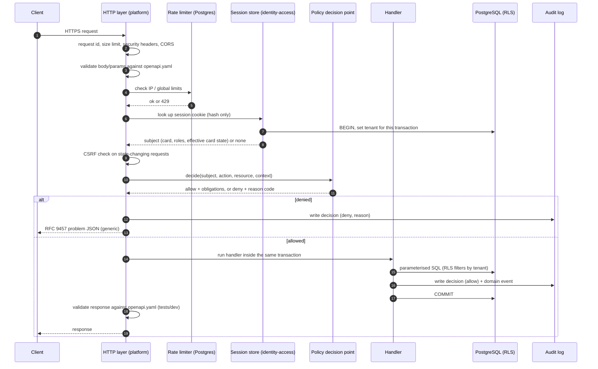

# 01 — Architecture

## In plain language

We are building **one small server program** (the API) and **one empty placeholder** (the AI service). The API is split inside into three clearly walled rooms — *identity-access*, *platform* and *billing* — so that any room can later be moved out into its own server without rewriting it. A robot (CI) checks on every change that nobody has knocked a hole in a wall.

Everything the API knows is stored in one PostgreSQL database. The database itself — not just our code — refuses to show one company's data to another company.

## Repo layout

```
LegacyAI/
├─ services/
│  ├─ api/                     TypeScript, Fastify. ONE deployable process.
│  │  ├─ openapi.yaml          The API contract. Source of truth.
│  │  ├─ src/
│  │  │  ├─ main.ts            Starts the server. Fails closed on bad config.
│  │  │  ├─ app.ts             Wires modules together (the only place that may).
│  │  │  ├─ shared/            Tiny, dependency-free helpers (types, errors, clock).
│  │  │  ├─ modules/
│  │  │  │  ├─ platform/       Part 5
│  │  │  │  │  ├─ index.ts     PUBLIC surface of the module (the only importable file)
│  │  │  │  │  └─ internal/    config, db, logging, tracing, http, audit, tenants,
│  │  │  │  │                  rate-limit, idempotency, notifications, export, health
│  │  │  │  ├─ identity-access/ Part 1
│  │  │  │  │  ├─ index.ts     PUBLIC surface
│  │  │  │  │  └─ internal/    cards, card-number, secret-code, lifecycle, auth,
│  │  │  │  │                  credentials, sessions, roles, policy (the PDP)
│  │  │  │  └─ billing/        Part 4 — interface + stub + TODO list only
│  │  │  │     └─ index.ts
│  │  │  └─ cli/               verify-audit-chain, anchor-audit-head, bootstrap-platform,
│  │  │                        sweep-expired-cards
│  │  ├─ test/                 unit/, integration/, security/, contract/
│  │  └─ Dockerfile
│  └─ ai/                      Python + FastAPI. /health only. Parts 2 and 3 arrive later.
├─ db/
│  ├─ migrations/              dbmate SQL files (up + down)
│  ├─ roles/                   create-roles.sql (owner, migrator, app, backup)
│  └─ seeds/                   roles, permissions, role_permissions, plan_limits
├─ infra/
│  ├─ terraform/               plan-only
│  └─ README.md                plain-language manual steps
├─ scripts/                    backup.sh, restore-test.sh, dev helpers
├─ docs/
│  ├─ DEPENDENCIES.md
│  ├─ decisions.md
│  └─ phase1/
└─ .github/workflows/
```

## How the five backend parts map to code

| Part | What it is | Lives in | Language | Phase 1 status |
|---|---|---|---|---|
| 1 | Identity, cards, access, policy decision point | `services/api` → `modules/identity-access` | TypeScript | **Built** |
| 2 | Knowledge capture / ingestion | `services/ai` | Python | Empty stub (`/health`) |
| 3 | AI / retrieval | `services/ai` | Python | Empty stub |
| 4 | Billing | `services/api` → `modules/billing` | TypeScript | Interface + TODO list only |
| 5 | Platform: tenants, audit log, security, observability, backups, infra | `services/api` → `modules/platform` | TypeScript | **Built** |

Service count: **2** backend services now (api, ai). The hard cap is 5. If modules are ever split out, the worst case is api-identity, api-platform, api-billing, ai = 4.

## Module boundaries and dependency rules

The rules, in plain words:

1. A module may be imported **only through its `index.ts`**. Anything under `internal/` is private to that module.
2. Allowed directions (an arrow means "may import"):
   - `identity-access` → `platform` (needs database, audit, config, logging)
   - `billing` → `platform`
   - `identity-access` → `billing` **public interface only** (the plan-limit hook)
   - `platform` → nothing (it is the base layer). It must **never** import `identity-access` or `billing`.
   - everything → `shared`; `shared` → nothing.
3. Where `platform` needs something from `identity-access` (for example the HTTP layer needs "who is this session?" and "is this allowed?"), `platform` declares an **interface** (a "port") and `app.ts` plugs the real implementation in at start-up. This keeps the arrows one-way.
4. Only `app.ts` and `main.ts` may wire modules together.
5. Database tables are owned by exactly one module (listed in `02-data-model.md`). A module never reads or writes another module's tables with SQL; it calls the owner's public functions.

Enforced by: `dependency-cruiser` rules in CI (build fails on a violation), plus an integration test that asserts the rule file itself still forbids a deliberately bad import ("seen it fire").



## Request flow

What happens to one request, start to finish. Every step that says "deny" ends the request immediately.



Three properties this flow guarantees by construction:

- **No handler runs without a decision.** The HTTP layer refuses to send a response for a non-public route if no policy decision was recorded for that request (it returns a 500 and logs loudly). A test also lists every route and fails if any lacks policy metadata.
- **No query runs without a tenant.** The only way to get a database connection is `withTenantTransaction(tenantId, fn)`, which opens a transaction and sets the tenant for that transaction only. If the tenant is missing, row-level security returns zero rows.
- **The audit row and the change commit together.** An allowed change and its audit record are in the same transaction, so there is never a change without a record.

## Technology choices (summary)

Details, sources and dates are in `docs/DEPENDENCIES.md`.

| Concern | Choice | One-line reason |
|---|---|---|
| Runtime | Node.js 24 LTS, TypeScript 6.0 strict | LTS today; linter supports it |
| Framework | Fastify 5 | Two years stable, written LTS policy, schema validation built in; NestJS 12 is 5 weeks old |
| Database access | `pg` driver, hand-written parameterised SQL, no ORM | RLS, grants and triggers must be explicit and readable |
| Migrations | dbmate (plain SQL, up + down) | SQL-first, language-neutral |
| Contract | `openapi.yaml` drives runtime validation and generated types | The contract cannot drift from the code |
| Tests | vitest; real PostgreSQL in Docker / CI service container | No mocks for the database — the database rules *are* the security |

## What is deliberately NOT here

No Redis, no queue, no separate auth service, no ORM, no frontend, no AI calls, no billing logic, no SSO/SCIM/QR/NFC/BYOK code. Hooks for those are columns and tables only (see `02-data-model.md`).
