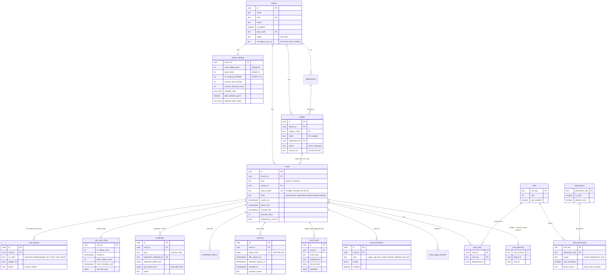
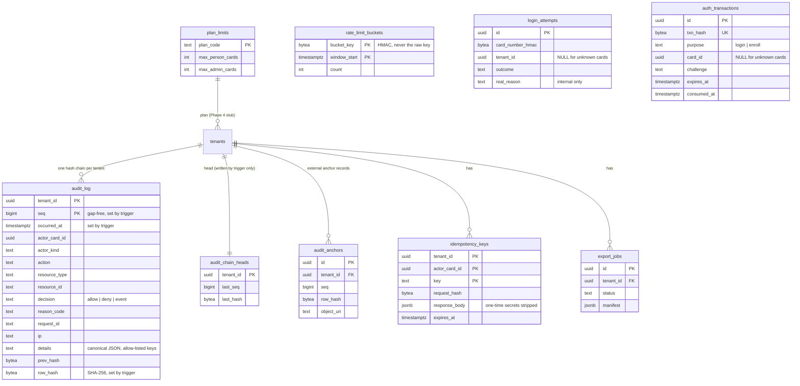
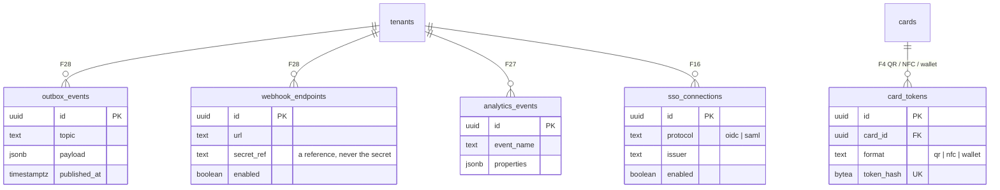

# Schema diagram

The database as built by `db/migrations/` (5 migrations, 33 tables). Verified against the live test database: **24 tenant-scoped tables with forced row-level security, 9 global tables** (asserted by `test/integration/rls.test.ts`).

- **T** = tenant-scoped: has `tenant_id`, row-level security enabled **and forced**.
- **G** = global: no tenant; the app role has only the narrow privileges noted.

## Identity and access

## Platform

## Design-only hooks (tables exist; no code reads or writes them; the app role has no privileges on them)

## Scope and privileges, table by table

| Table | Scope | App role may | Notes |
|---|---|---|---|
| tenants | T (by `id`) | SELECT, INSERT, UPDATE | plus a read-only cross-tenant policy used only for the operator's tenant list |
| tenant_settings | T | SELECT, INSERT, UPDATE | ranges enforced by CHECK constraints |
| departments | T | SELECT, INSERT | |
| people | T | SELECT, INSERT, UPDATE | |
| cards | T | SELECT, INSERT, UPDATE | lifecycle trigger rejects illegal state changes |
| card_secrets | T | SELECT, INSERT, UPDATE | hash destroyed (NULL) on rotation |
| card_auth_state | T | SELECT, INSERT, UPDATE | |
| credentials | T | SELECT, INSERT, UPDATE | |
| enrollment_tokens | T | SELECT, INSERT, UPDATE | token stored as SHA-256 only |
| sessions | T | SELECT, INSERT, UPDATE | token stored as SHA-256 only |
| card_events | T | SELECT, **INSERT only** | append-only for the app |
| card_restrictions | T | SELECT, INSERT, UPDATE, DELETE | |
| card_usage_counters | T | SELECT, INSERT, UPDATE, DELETE | |
| card_roles | T | SELECT, INSERT, UPDATE, DELETE | |
| audit_log | T | SELECT, **INSERT only** | plus a trigger that blocks UPDATE / DELETE / TRUNCATE for every role |
| audit_chain_heads | T | SELECT | written only by the audit trigger |
| audit_anchors | T | SELECT, INSERT | |
| idempotency_keys | T | SELECT, INSERT, UPDATE, DELETE | |
| export_jobs | T | SELECT, INSERT, UPDATE | |
| outbox_events, webhook_endpoints, analytics_events, card_tokens, sso_connections | T | **nothing** | design-only |
| roles, permissions, role_permissions, plan_limits | G | SELECT | policy data; changed only by migration |
| card_directory | G | **nothing** | reachable only through `resolve_card()` (exact match) |
| login_attempts | G | **INSERT only** | real failure reasons; never readable by the app |
| auth_transactions | G | SELECT, INSERT, UPDATE, DELETE | global so known and unknown cards look the same |
| rate_limit_buckets | G | SELECT, INSERT, UPDATE, DELETE | keys are HMACs |
| schema_migrations | G | SELECT | readiness check |

## Database roles (created by `db/roles/create-roles.sql`)

| Role | Purpose | Superuser | BYPASSRLS |
|---|---|---|---|
| `legacyai_migrator` | owns the tables, runs migrations | no | no |
| `legacyai_app` | the running API | no | **no** (the API checks this at start-up and refuses to run otherwise) |
| `legacyai_backup` | nightly `pg_dump` (read-only via `pg_read_all_data`) | no | yes — a backup must see every tenant |
