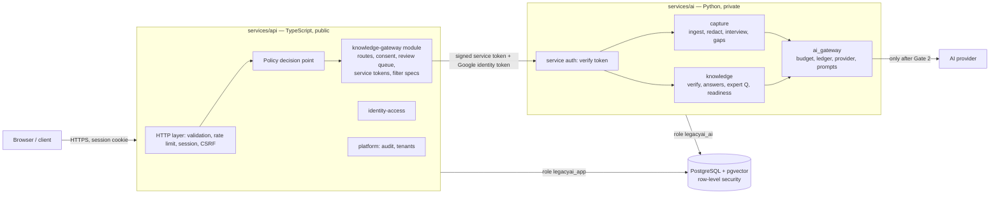
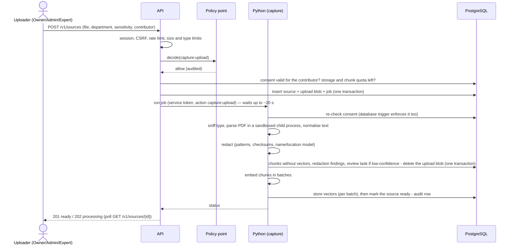
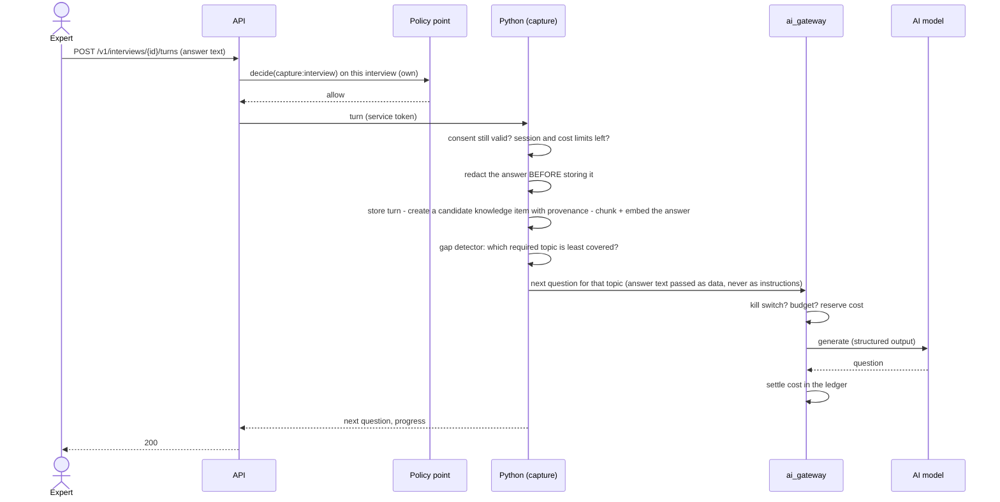
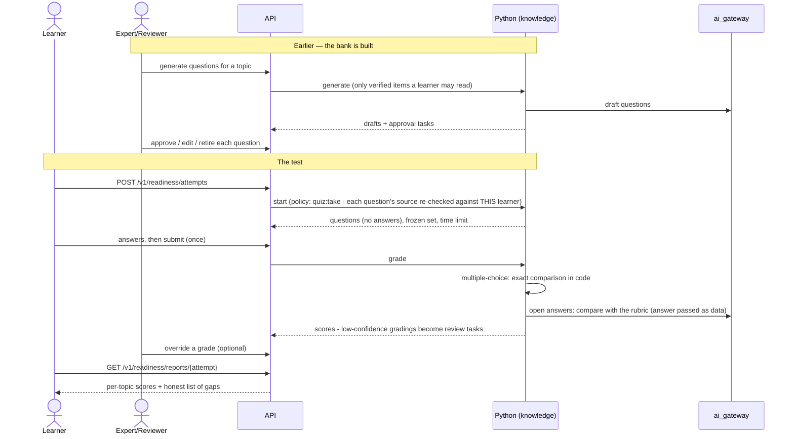
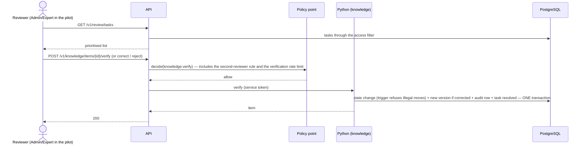

# 01 — Architecture (Phase 2: capture, knowledge, AI)

> Phase 2 design. **Nothing in this document is built yet.** It is a proposal for Gate 1.
> Facts about tools, prices and limits were checked on the web on 2026-10-03; sources are in `docs/DEPENDENCIES.md` §9. Anything not checked is marked **ASSUMPTION**.

## In plain language

Phase 1 built the front door: who you are, what you may do, and a record of everything. Phase 2 puts the product behind that door: documents and interviews go in, knowledge items come out, experts confirm them, learners ask questions and take tests.

Three programs run:

1. **The TypeScript API** (exists). It stays the **only** thing the internet can talk to. Every Phase 2 request goes through the same sign-in, CSRF, rate-limit and policy checks as Phase 1 — there is no second front door to secure.
2. **The Python service** (today an empty stub). It does the heavy work: reading PDFs, redacting, searching, talking to the AI model. It is **private**: it only accepts calls from the API, and each call carries a short-lived signed note saying *who* is asking and *what they are allowed to see*.
3. **The database** (PostgreSQL on Neon). Both programs use it, each with its own restricted login. The database itself enforces the wall between companies, exactly as in Phase 1.

No new service is added. The service count stays at **2 of the allowed 5**.

The one rule that shapes everything: **the Python service never decides who may see what.** The decision is made by the Phase 1 policy decision point in the API, travels to Python as data, is applied inside the search query, and is checked again by the API before any text is given to the AI model.

## The pieces

### Module boundaries

| Where | Module | Owns | May call |
|---|---|---|---|
| API | `identity-access`, `platform`, `billing` | as in Phase 1 | as in Phase 1 |
| API | **`knowledge-gateway`** (new) | Phase 2 routes; `consents`, `review_tasks`, `knowledge_settings`, `ai_budgets` (the pure data/workflow tables); minting service tokens; building filter specs | `identity-access` and `platform` through their public doors only (same CI rule as Phase 1) |
| Python | **`platform`** | database access, service-token check, job queue, audit writer, config | — |
| Python | **`ai_gateway`** | provider interface, fake provider, budgets, kill switch, cost ledger, prompt files | `platform` |
| Python | **`capture`** (Backend Part 2) | sources, chunks, redaction, interviews, topics, gap detector | `platform`, `ai_gateway` |
| Python | **`knowledge`** (Backend Part 3) | knowledge items, answers, expert questions, readiness tests | `platform`, `ai_gateway`, and `capture` **only through its public functions** (retrieval) |

`capture` never imports `knowledge`. `knowledge` never touches `capture`'s tables with SQL of its own — it calls `capture.retrieve(...)`. A lint rule (ruff's banned-import rule, configured per package) fails CI on a violation, and a CI self-test breaks the rule on purpose to see it fire — the same "seen it fire" standard as Phase 1.

## Service-to-service: how the private service stays private at $0

The Phase 1 report flagged this as unresolved: the AI service was set to "internal only", which on Cloud Run needs a private network, and as written nothing could reach it.

**What I verified (2026-10-03, Google Cloud documentation):**

| Option | What it is | Cost at zero traffic | Notes |
|---|---|---|---|
| **A. Public address + "require authentication"** | The AI service has an internet address, but Google checks every request for an identity token issued to the API's service account and rejects everything else before it reaches our container. | **$0.** IAM is free. Rejected requests are not billed. Same-region service-to-service traffic is free. | The address exists and can be probed. Google documents that IAM-rejected requests "are not billed"; it does **not** say in so many words that a rejected request can never start an instance — **UNVERIFIED**. |
| B. "Internal" + Direct VPC egress | Calls travel over a private network. | **Not $0 for us.** Direct VPC egress itself has no standing charge, but to make it work the API must either send all its traffic through the private network — then it needs Cloud NAT to reach Neon (hourly charge) — or use a private DNS zone (about $0.20/month, no free tier). | Also adds start-up delays of up to "a minute or more" (Google's wording). |
| C. Serverless VPC connector | Older way to do B. | About **$12/month** always-on (two small VMs minimum). | Rejected. |
| D. Cloud Service Mesh | Newer. | Preview; per-client hourly fee; needs paid DNS. | Rejected. |

**Proposal: option A**, plus our own second lock:

1. **Google's lock.** The AI service requires authentication; only the API's service account holds the invoker role. The API sends Google's identity token in the `X-Serverless-Authorization` header (Google removes it before our code sees the request).
2. **Our lock.** Every call also carries **our own signed service token** in `Authorization`. It works the same on Cloud Run, in CI and on a laptop, so the tests exercise the real check.

This changes one Phase 1 guardrail: "AI service opened to the internet" currently fails CI. It becomes "AI service must require authentication and must have exactly one invoker". The guardrail self-test is updated to break that on purpose.

> Open decision 6 in `11-open-decisions.md`: accept a probe-able address (A, $0) or pay about $0.20/month for B.

### The service token

A JSON Web Token, signed with HMAC-SHA-256 using the **existing** `internal-service-token` secret (so no seventh secret — Secret Manager's free tier is six). Libraries: `jose` (TypeScript) and `PyJWT` (Python), algorithm pinned to `HS256` on both sides. No hand-written signing.

| Claim | Content |
|---|---|
| `iss`, `aud` | `legacyai-api` → `legacyai-ai`. Python refuses anything else. |
| `iat`, `exp` | Lifetime **60 seconds**. |
| `jti`, `request_id` | Unique id; ties Python's log lines and audit rows to the API request. |
| `tenant_id`, `card_id`, `person_id` | Who is asking. Built by the API from the session — never from request input. |
| `roles`, `card_phase` | The card's roles and whether it is `normal` or `grace` (read-only). A suspended, revoked or lapsed card never gets a token: the API refuses the request first. |
| `action` | The one permission this call was authorised for (for example `knowledge:ask`). Python refuses to do anything else with it. |
| `filter` | The **structured access filter** for this subject (see `03`). Data, not SQL. |
| `approved_chunks` | Only on the second step of an answer: the exact chunk ids the policy decision point approved for the prompt (see below). |
| `budget` | Per-request token ceilings for this plan. |

What the token is **not**: a session. It cannot be used at the public API, lives for a minute, and is useless outside the one action it names.

Why symmetric signing: both ends are ours and already share this secret; an asymmetric key would need a seventh secret. The cost of that choice: if the Python service were compromised it could forge tokens *to itself* — which gives an attacker who already controls it nothing new.

## Two-step answers: the policy decision point approves what the model sees

The requirement is that every chunk is re-checked by the policy decision point before it enters a prompt. The policy decision point lives in the API. So an answer takes **two calls** from the API to Python:

1. **Retrieve.** Python runs the search (with the filter inside the query) and returns candidates — ids and their access labels, no text.
2. The **API** puts every candidate to `decide()` — the same function that guards every Phase 1 route. Anything not allowed is dropped and counted as a disagreement (expected: zero; the leakage tests assert it).
3. **Answer.** The API calls Python again with a token listing exactly the approved ids. Python loads those chunks (again under row-level security and the filter), builds the prompt, calls the model, validates citations.

Python can therefore never put a chunk into a prompt that the policy decision point did not approve in this very request. The price is one extra internal round trip (same region, no charge).

## Who writes the audit log

The audit hash chain must have **one writer path**. Two candidates:

| | Python calls an internal audit endpoint on the API | Python writes through a database function |
|---|---|---|
| Atomic with Python's own changes? | **No.** "Item verified" and "audit row written" would be two transactions on two connections; a crash between them leaves an action with no record. | **Yes.** Same transaction: both commit or neither does. |
| One place computes the chain? | Yes | Yes — the chain is computed by the Phase 1 database trigger whichever role inserts |
| Extra moving parts | An HTTP call per event; Python needs a route back to the API; failure handling | None |
| Who enforces "no secrets or names in details"? | The API's allow-list in TypeScript | Must move into the database |

**Proposal: the database function.** A new function `audit_write(...)` checks the detail keys against a table of allowed keys and inserts the row; the existing trigger assigns the sequence number and hash. **Both** services call that function — the API's `writeAudit` is changed to use it — so there is exactly one path, and the allow-list is enforced once, in the database, for both. The Python database role gets `EXECUTE` on the function and `SELECT` on nothing in the audit tables; no `UPDATE`, no `DELETE` (those are refused by Phase 1 triggers for every role anyway).

Test: after a run of Python-originated events, the Phase 1 verifier (independent TypeScript code) must still report every chain intact.

## Background work without background processes

Cloud Run with scale-to-zero only gives our code CPU **while a request is being handled** (request-based billing; always-on CPU costs money and is not allowed). A worker loop that polls a queue would simply not run. A scheduler that pings every minute would keep the free database awake and use up its monthly hours (red flag 5 in Phase 1's `06`).

So the queue is a table, and work advances **only during requests**:

- Uploading a document creates a `jobs` row and the API immediately asks Python to work on it, waiting up to ~20 seconds.
- If the job finishes in time, the upload answers "ready". If not, it answers "processing", and **each time the client asks for the status**, the API asks Python to continue for another slice.
- Every stage commits its own progress, so a slice that is cut off loses at most one stage's work, and a retry never does the same thing twice.

Limits are set so that a normal document finishes in the first slice. Details in `05`.

Nothing here needs Redis or a new service. **What I could not verify:** whether Cloud Run keeps giving CPU to a request whose caller has hung up. The design does not depend on it.

## Sequence diagrams

### Ingest a document

### Run an interview turn

### Ask a question

### Take a readiness test

### Expert verification

## Runtime settings (Cloud Run, still plan-only)

| Setting | API | AI service | Why |
|---|---|---|---|
| min / max instances | 0 / 2 | 0 / 1 | unchanged |
| memory | 512 MiB | **1 GiB** (was 512 MiB) | the PII model, PDF parsing and the local embedding model do not fit in 512 MiB (**ASSUMPTION** — no first-party memory figure exists; measured in CI before Gate 2) |
| request timeout | 30 s → **60 s** | 30 s → **120 s** | the upload and answer routes wait for Python; Python needs room for an AI call |
| ingress | all | **all + authentication required** (was internal) | option A above |
| billing | request-based | request-based | $0 when idle |

More memory and longer requests use the free allowance faster under load; at zero traffic the cost stays **$0**. Numbers in `08`.

## What does not change

- Sign-in, sessions, cards, roles, the audit chain, backups: untouched.
- The CI rule "every route declares a policy" covers the new routes automatically.
- The Phase 1 internal policy-check endpoint stays, limited to knowledge actions as it is.
