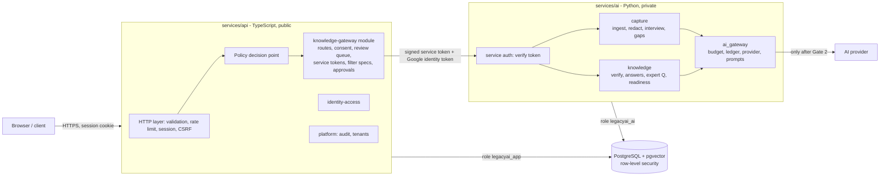
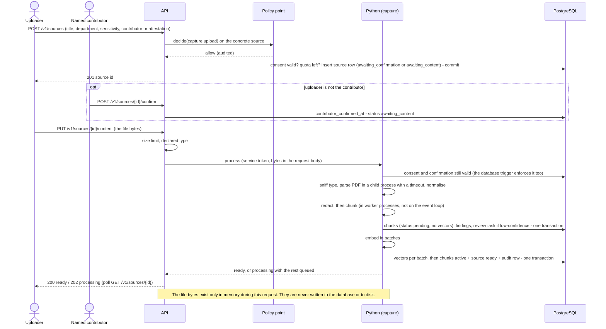
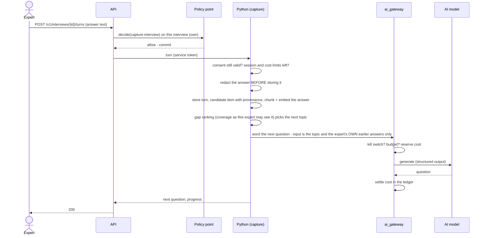
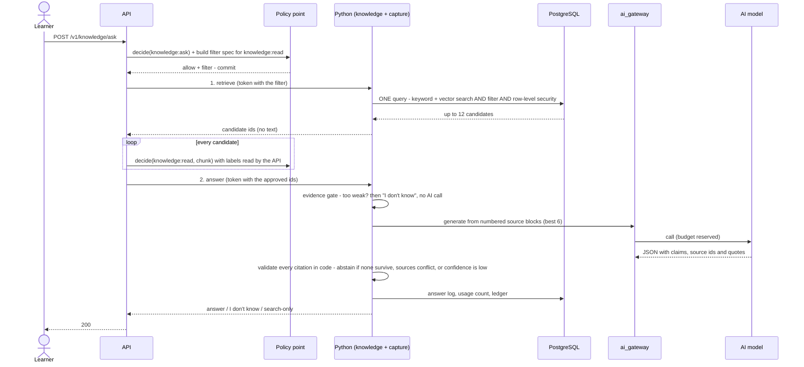
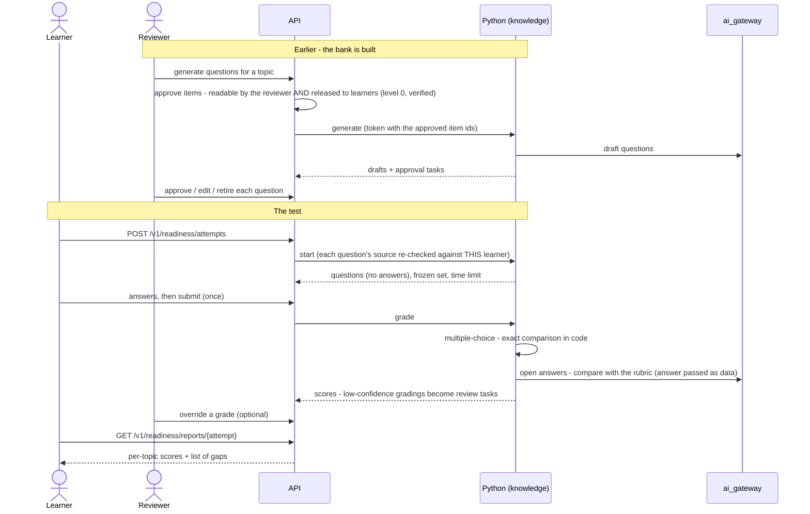
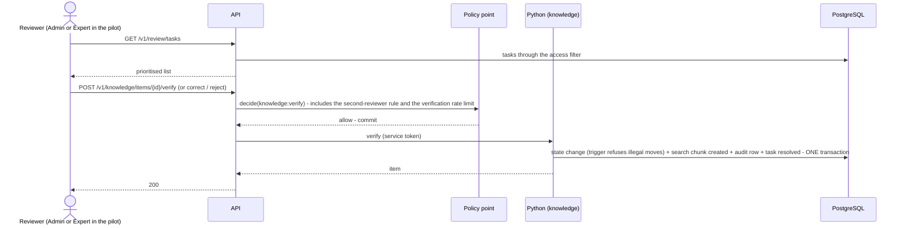

# 01 — Architecture (Phase 2: capture, knowledge, AI)

> Phase 2 design. **Nothing in this document is built yet.** It is a proposal for Gate 1.
> Facts about tools, prices and limits were read on the web on 2026-10-03; sources are in `docs/DEPENDENCIES.md` §9. Anything not checked is marked **ASSUMPTION** or **UNVERIFIED**.
> Revised after an independent review of the first draft (see `11`, "What the review changed").

## In plain language

Phase 1 built the front door: who you are, what you may do, and a record of everything. Phase 2 puts the product behind that door: documents and interviews go in, knowledge items come out, experts confirm them, learners ask questions and take tests.

Three programs run:

1. **The TypeScript API** (exists). It stays the **only** thing the internet can talk to. Every Phase 2 request goes through the same sign-in, CSRF, rate-limit and policy checks as Phase 1 — there is no second front door.
2. **The Python service** (today an empty stub). It does the heavy work: reading PDFs, redacting, searching, talking to the AI model. It is **private**: it only accepts calls from the API, and each call carries a short-lived signed note saying *who* is asking and *what they are allowed to see*.
3. **The database** (PostgreSQL on Neon). Both programs use it, each with its own restricted login.

No new service is added. The service count stays at **2 of the allowed 5**.

The rule that shapes everything: **the Python service does not decide who may see what.** The decision is made by the Phase 1 policy decision point in the API, travels to Python as data, is applied inside the search query, and is checked again by the API before stored text is given to the AI model.

What that rule does *not* cover, stated plainly: the Python service is trusted to *apply* the decision and to tell the database which company it is working for. If the Python service itself were taken over, the attacker could read the Phase 2 content of every company. It still could not read cards, sign-in secrets or sessions, and could not sign anyone in (`07`).

## The pieces

### Module boundaries

| Where | Module | Responsible for | May call |
|---|---|---|---|
| API | `identity-access`, `platform`, `billing` | as in Phase 1 | as in Phase 1 |
| API | **`knowledge-gateway`** (new) | Phase 2 routes; consent, review queue, settings, topic lists (pure data and workflow); minting service tokens; building filter specs; approving what enters a prompt | `identity-access` and `platform` through their public doors only (same CI rule as Phase 1) |
| Python | **`platform`** | database access, service-token check, queue and housekeeping, audit writer, config | — |
| Python | **`ai_gateway`** | provider interface, fake provider, budgets, kill switch, cost ledger, prompt files | `platform` |
| Python | **`capture`** (Backend Part 2) | sources, chunks, redaction, interviews, gap detector, retrieval | `platform`, `ai_gateway` |
| Python | **`knowledge`** (Backend Part 3) | knowledge items, answers, expert questions, readiness tests | `platform`, `ai_gateway`, and `capture` **only through its public functions** |

Which database login may do what to which table is one table in `02` ("Who writes what").

`capture` never imports `knowledge`. `knowledge` never touches `capture`'s tables with SQL of its own. A lint rule (ruff's banned-import rule, configured per package) fails CI on a violation, and a CI self-test breaks the rule on purpose to see it fire — the same "seen it fire" standard as Phase 1.

## Service-to-service: how the private service stays private at $0

The Phase 1 report flagged this as unresolved: the AI service was set to "internal only", which on Cloud Run needs a private network, and as written nothing could reach it.

**What I read (2026-10-03, Google Cloud documentation):**

| Option | What it is | Cost at zero traffic | Notes |
|---|---|---|---|
| **A. Public address + "require authentication"** | The AI service has an internet address, but Google checks every request for an identity token issued to the API's service account and rejects everything else before it reaches our container. | **$0.** IAM is free. Requests denied by IAM are not billed. Same-region service-to-service traffic is free. | The address exists and can be probed. Google documents that IAM-rejected requests "are not billed"; whether a rejected request can start an instance is **UNVERIFIED**. |
| B. "Internal" + Direct VPC egress | Calls travel over a private network. | **Not $0 for us.** Direct VPC egress itself has no standing charge, but to make it work the API must either send all its traffic through the private network — then it needs Cloud NAT to reach Neon (hourly charge) — or use a private DNS zone (about $0.20/month, no free tier). | Google's documentation also warns of connection delays "of a minute or more" on instance start-up. |
| C. Serverless VPC connector | Older way to do B. | About **$12/month** always-on (two small VMs minimum; my arithmetic from the published VM price). | Rejected. |
| D. Cloud Service Mesh | Newer. | Preview; per-client hourly fee; needs paid DNS. | Rejected. |

**Proposal: option A**, plus our own second lock:

1. **Google's lock.** The AI service requires authentication; only the API's service account holds the invoker role. The API sends Google's identity token in the `X-Serverless-Authorization` header (Google removes it before our code sees the request).
2. **Our lock.** Every call also carries **our own signed service token** in `Authorization`. It works the same on Cloud Run, in CI and on a laptop, so the tests exercise the real check.

This changes one Phase 1 guardrail: "AI service opened to the internet" currently fails CI. It becomes "the AI service must require authentication and must have exactly one invoker". The guardrail self-test is updated to break that on purpose.

> Open decision 6 in `11`: accept a probe-able address (A, $0) or pay about $0.20/month for B.

### The service token

A JSON Web Token signed with HMAC-SHA-256. Libraries: `jose` (TypeScript) and `PyJWT` (Python), algorithm pinned to `HS256` on both sides. No hand-written signing.

| Claim | Content |
|---|---|
| `iss`, `aud` | `legacyai-api` → `legacyai-ai`. Python refuses anything else. |
| `iat`, `exp` | Lifetime **60 seconds**. |
| `jti`, `request_id` | Unique id; ties Python's log lines and audit rows to the API request. |
| `tenant_id`, `card_id`, `person_id` | Who is asking. Built by the API from the session — never from request input. |
| `roles`, `card_phase` | The card's roles and whether it is `normal` or `grace`. A suspended, revoked or lapsed card never gets a token: the API refuses the request first. |
| `action` | The one operation this call was authorised for. Python refuses to do anything else with it. |
| `filter` | The structured access filter for this subject (`03`). Data, not SQL. |
| `approved` | For prompts that contain stored content: the exact ids the policy decision point approved (`03`). |
| `limits` | Per-request token ceilings for this plan and feature. |

What the token is **not**: a session. It is useless at the public API, lives for a minute, and names one operation.

**The signing key and the old internal endpoint.** Phase 1 has an internal policy-check endpoint on the public API, protected by a static secret (`INTERNAL_SERVICE_TOKEN`). In this design the Python service never calls the API, so **that endpoint is removed** (the contract goes from 47 operations to 46 before the Phase 2 routes are added). The secret is kept and becomes the token-signing key only. Reason for removing rather than keeping: otherwise the same secret would both sign tokens *and* open a public endpoint, and it would be held by the service that parses untrusted PDFs.

Why a shared (symmetric) key: both ends are ours; an asymmetric key pair would need one more secret. Consequence: a taken-over Python service could forge tokens *to itself*, which gives it nothing it does not already have.

### Secrets: five, inside the free six

| Secret | Contains | Read by |
|---|---|---|
| `database-url` | the API's database login | API |
| `database-url-admin` | migration / backup login | backup job, operator |
| `api-keyrings` | SC pepper keyring, credential-encryption keyring, HMAC index key (one JSON value; today three separate secrets) | API |
| `service-token-key` | the signing key above (today `internal-service-token`) | API, AI service |
| `ai-service-config` | the Python service's database login and — after Gate 2 — the AI provider key (one JSON value) | AI service |

Grouping costs some rotation convenience (rotating one key means writing the group again). It keeps the bill at $0.

## How a gateway request runs (a change to the Phase 1 HTTP layer)

In Phase 1 a request's handler runs **inside** one database transaction. That cannot work when the handler has to wait for Python: rows the API wrote would be invisible to Python until the transaction ended, and every waiting request would hold one of the API's few database connections for up to a minute.

So the HTTP layer gains a second kind of route, used by every route that calls Python:

1. **Decide and prepare — one short transaction.** Session, CSRF, policy decision, idempotency record, and any rows the API itself must write (for example the `sources` row of a new upload). The "allowed" audit row is written here. **Commit.**
2. **Call Python — no transaction, no database connection held.** With a service token.
3. **Finish — one short transaction.** Store the idempotency result; if Python failed, write the "allowed but failed" audit row Phase 1 already writes for failed requests.

Python does its own work in its own transactions and writes its own audit rows through the shared function (below). The Phase 1 routes keep their single-transaction behaviour unchanged. The route-coverage test is extended so that a gateway route without a policy still cannot be registered.

## Approving what the model sees

Every prompt that contains **stored** content gets its content approved by the policy decision point first (`03`, "Lock 3"). For an answer that means two calls from the API to Python:

1. **Retrieve.** Python runs the search (filter inside the query) and returns candidates — ids only, no text.
2. The **API** puts every candidate to `decide()`, with labels it reads itself. Anything not allowed is dropped and counted as a disagreement (expected: zero).
3. **Answer.** The API calls Python again with a token listing the approved ids. Python loads those chunks (again under row-level security and the filter), builds the prompt, calls the model, validates citations.

The design intent is that Python has no code path that puts a stored chunk into a prompt without an approved id for it in the token; a test per prompt checks what the (fake) provider actually received. Prompts that contain no stored content — only what the caller just typed, or their own earlier answers — need no approval step; which prompts those are is listed in `03`.

## Who writes the audit log

The audit hash chain must have **one writer path**. Two candidates:

| | Python calls an internal audit endpoint on the API | Python writes through a database function |
|---|---|---|
| Atomic with Python's own changes? | **No.** "Item verified" and "audit row written" would be two transactions on two connections; a crash between them leaves an action with no record. | **Yes.** Same transaction: both commit or neither does. |
| One place computes the chain? | Yes | Yes — the chain is computed by the Phase 1 database trigger whichever role inserts |
| Extra moving parts | An HTTP call per event; Python needs a route back to the API | None |
| Who enforces "no secrets or names in details"? | The API's allow-list in TypeScript | Must move into the database |

**Proposal: the database function.** A new function `audit_write(...)` checks the detail keys against a table of allowed keys and inserts the row; the existing trigger assigns the sequence number and hash. **Both** services call it — the API's `writeAudit` is changed to use it — so there is one path and one allow-list. When Python is the caller the function forces the actor kind to `service`, so Python cannot write a row that looks like a card's own decision (`02` §F).

Test: after a run of Python-originated events, the Phase 1 verifier (independent TypeScript code) must still report every chain intact.

## Work that outlives a request

Cloud Run with scale-to-zero gives our code CPU **only while a request is being handled** (request-based billing; always-on CPU costs money). A worker loop polling a queue would not run. A scheduler pinging every minute would keep the free database awake and use up its monthly hours (red flag 5 in Phase 1's `06`).

The design therefore avoids needing background work wherever it can, and names the request that drives each piece where it cannot:

| Work | When it happens |
|---|---|
| Parse, redact and chunk an upload | **inside the upload request.** If it does not finish, the upload fails and nothing is kept. |
| Embed the chunks | inside the upload request for as long as time allows; any remainder is a queued `embed` job, continued when the client asks for the source's status. The source is not searchable until all of it is done. |
| **Hide withdrawn material** | **inside the withdrawal request, in the same transaction** — nothing is served afterwards. |
| Erase withdrawn material | inside the withdrawal request, straight after hiding; a queued job only if that fails |
| Mark items stale, expire questions and attempts, pause idle interviews, prune old logs, retry failed jobs | **housekeeping:** every Python request first spends a bounded slice (up to ~1 second) on that company's due work. A company with no traffic has nothing being served, and its due work runs on its next request. |
| Database-size warning | the existing nightly backup job (read-only) prints the size and warns (`08`) |

The queue is a table (`jobs`) claimed with `FOR UPDATE SKIP LOCKED` and a lease. No Redis, no new service.

**Consequences to accept:** time-based changes (an item becoming stale, a question expiring) take effect on a company's *next request* after the due time, not at the due time — queries that matter also check the due time directly, so an overdue item is treated as stale even before housekeeping has written it down. **What I could not verify:** whether Cloud Run keeps giving CPU to a request whose caller has hung up. The design does not depend on it.

## Sequence diagrams

### Ingest a document

### Run an interview turn

### Ask a question

### Take a readiness test

### Expert verification

## Time budgets

| Step | Limit |
|---|---|
| API request (Cloud Run) | 60 s (was 30 s) |
| Python request (Cloud Run) | 120 s (was 30 s) |
| Whole "ask" inside the API | 45 s deadline: retrieve ≤ 5 s, approvals ≤ 2 s, answer ≤ 35 s |
| One AI provider call | 20 s timeout |
| Retry of a provider call | at most one, and only if the first failed fast enough to leave 20 s of the deadline |
| PDF parse child process | 20 s |
| Upload request in total | 55 s; what is not embedded by then is queued |
| Housekeeping slice | ~1 s |

**ASSUMPTION:** that a 50-page text PDF parses, redacts and chunks inside one upload request on one small CPU. A CI test measures it on the golden documents before Gate 2; if it does not fit, the page limit is lowered to what does. A document that cannot be processed in one request fails with `too_complex` at once — it is not retried five times.

## Runtime settings (Cloud Run, still plan-only)

| Setting | API | AI service | Why |
|---|---|---|---|
| min / max instances | 0 / 2 | 0 / 1 | unchanged |
| memory | 512 MiB | **1 GiB** (was 512 MiB) | the redaction model, PDF parsing and the local embedding model (**ASSUMPTION** — no first-party memory figure exists; measured in CI before Gate 2) |
| request timeout | 60 s | 120 s | above |
| ingress | all | **all + authentication required** (was internal) | option A |
| billing | request-based | request-based | $0 when idle |

More memory and longer requests use the free allowance faster under load; at zero traffic the cost stays **$0**. Numbers in `08`.

## What changes in Phase 1 code

Listed in one place in `11`: the gateway route kind; `audit_write()`; new fields and two new guards in the policy decision point; the wider key on `role_permissions`; removal of the internal policy endpoint; secrets regrouped; Terraform guardrail for the AI service. Sign-in, sessions, cards, the audit chain format and backups are not touched.
