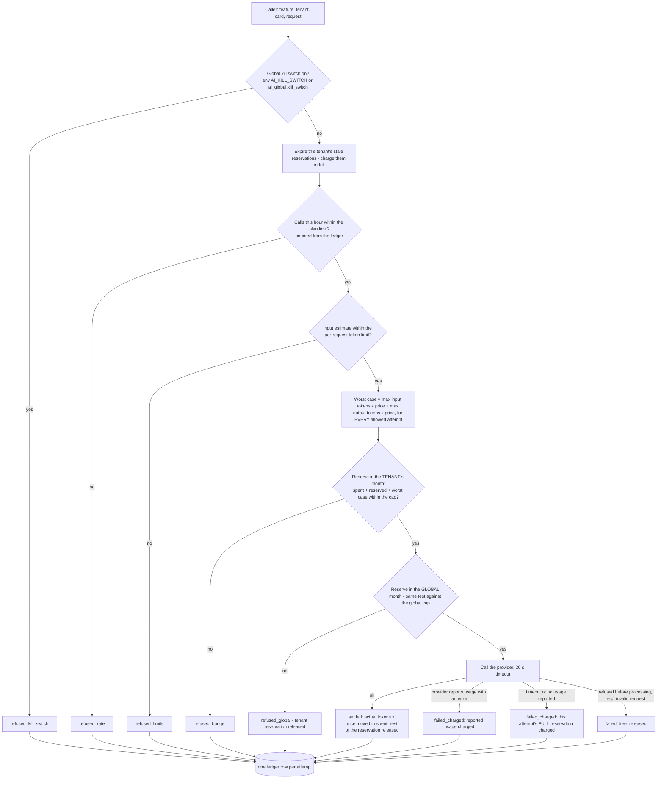

# 04 — AI gateway

> Phase 2 design. **Nothing in this document is built yet.** It is a proposal for Gate 1.
> Provider facts (models, prices, limits, terms) were read **once**, on 2026-10-03, from the providers' own pages; library versions were read twice. Sources: `docs/DEPENDENCIES.md` §9. **No AI call has been made. No key exists.** Everything about providers is re-read at Gate 2 before a key is created.
> Revised after an independent review of the first draft (see `11`, "What the review changed").

## In plain language

Every use of an AI model in LegacyAI goes through one small piece of code, the gateway. Nothing else in the system knows which company's model is behind it. The gateway has four jobs:

1. **Hide the provider.** The rest of the code asks for "generate text" or "turn text into a vector". Swapping the provider is a configuration change.
2. **Hold the purse.** Before any call it checks: is AI switched off globally? Has this company used up its monthly allowance? Has the whole system? If yes, the call is **not made**.
3. **Write down every call.** Who, for which feature, which model, how many tokens, what it cost.
4. **Be fakeable.** In every automated test the "model" is a small deterministic program that costs nothing. CI never talks to a real provider.

Until you give a key at Gate 2, the fake is the only provider that exists.

**How hard is the cap, honestly?** Our own cap is designed so that a company's month cannot go over by more than the estimating error of the last request — cents. It is not a mathematical guarantee: we count with our own price list and the provider's reported usage. The provider's own hard limit, which you set in their console, is the wall that does not depend on our code being right.

## Interface

Two operations. No tool use, no web access, no file access for the model, no streaming in Phase 2.

```python
class Provider(Protocol):
    async def generate(self, req: GenerateRequest) -> GenerateResult: ...
    async def embed(self, req: EmbedRequest) -> EmbedResult: ...

GenerateRequest:  model, system (fixed instructions), data_blocks (untrusted text, labelled),
                  output_schema (JSON schema), max_output_tokens, prompt_version
GenerateResult:   parsed (validated against output_schema), input_tokens, output_tokens, stop_reason
EmbedRequest:     texts, kind ("document" | "query"), model
EmbedResult:      vectors (384 numbers each)
```

Callers never build a provider request themselves and never see a raw response. The gateway is the only module that imports a provider's library; a lint rule enforces that.

**Instructions and data are separate arguments.** `system` comes only from a versioned prompt file. Documents, interview answers, questions and learner answers go in `data_blocks`, each wrapped and labelled as untrusted material. There is no code path that concatenates user text into the instruction part.

**Output is validated.** The model must return JSON matching `output_schema`. Anything else — wrong shape, extra fields, text around the JSON — is treated as a failed attempt, never passed on.

## Providers

| Name | When | What it is |
|---|---|---|
| `fake` | **default; the only one in CI and before Gate 2** | Deterministic. `generate` returns a scripted or rule-based answer derived from the input, and can be scripted per test to misbehave: invent a citation, obey an injected instruction, return broken JSON, time out. It records everything it was sent, so tests can check what reached "the model". `embed` returns a vector computed from a hash of the normalised words, so similar texts get similar vectors and results are identical on every machine. Costs are computed with a made-up price so the budget code is exercised. |
| `local-embed` | embeddings, if you choose it (recommended) | A small open model run inside the Python service. No provider, no key, $0 per call, no ledger rows. |
| one real chat provider | **only after Gate 2**, behind configuration | Selected by `AI_PROVIDER`; the key is read from the environment (Secret Manager in the cloud). If unset the service starts with `fake` and says so in its log and in `/health`. A real provider cannot be selected in CI: the test configuration refuses to start if a real key is present. |

### Chat model — options read on 2026-10-03

US dollars per million tokens, input / output. "Age" matters because of our 60-day maturity rule (`docs/decisions.md`, D2).

| Model (API id) | Price | Age | Passes 60-day rule | Notes |
|---|---|---|---|---|
| Claude Haiku 4.5 (`claude-haiku-4-5-20251001`) | $1 / $5 | 353 days | yes | Structured JSON output generally available. Its listed earliest retirement date is 2026-10-15; no retirement has been announced, and Anthropic's stated policy is at least 60 days' notice. |
| Claude Sonnet 5 (`claude-sonnet-5`) | $2 / $10 | 95 days | yes | mid-tier |
| Claude Sonnet 5.5 (`claude-sonnet-5-5`) | $2 / $10 | 5 days | **no** | too new |
| GPT-5.6 Luna (`gpt-5.6-luna`) | $0.20 / $1.20 | 86 days | yes | cheapest option that passes the rule. *Read through a page summariser, not raw text.* |
| GPT-6 Luna (`gpt-6-luna`) | $0.10 / $0.50 | 11 days | **no** | too new |
| Gemini 3.1 Flash-Lite (`gemini-3.1-flash-lite`) | $0.25 / $1.50 | 149 days | yes | shutdown announced for 2027-05-07. *Read through a summariser.* |
| Gemini 3.5 Flash-Lite (`gemini-3.5-flash-lite`) | $0.30 / $2.50 | 74 days | yes | *Read through a summariser.* |

Things that matter more than price for this product:

| | Anthropic | OpenAI | Google (Gemini API) |
|---|---|---|---|
| Trains on API data by default? | No | No | **Paid: no. Free tier: yes**, and people may read it — the free tier must not be used with customer data |
| Default retention | deleted within 30 days | abuse logs up to 30 days | 55 days (abuse logs) |
| **Hard monthly spending limit you can set yourself** | **Yes** — per workspace; requests are refused when reached. Needs a non-default workspace. | **Yes** (since 2026-07-22) — per project; documented as "not instantaneous" | Partly — project caps are marked experimental with ~10 minutes of overrun |
| Billing | prepaid credits; when they run out the API stops | prepaid credits, minimum $5 | prepaid, minimum $5 |
| Rate limits for a new account | 1,000 requests/min on the entry tier | 500 requests/min | not published |

**Recommendation for Gate 2 (your decision, open decision 1):** run the evaluation on **two** candidates under one small cap — Claude Haiku 4.5 and GPT-5.6 Luna — and choose with the measured numbers: citation behaviour, correct refusals, answer correctness, and cost per question. On price alone GPT-5.6 Luna is roughly five times cheaper; whether it is good enough at the cautious behaviour this product needs is what the evaluation is for. *A caution about my own advice: I am an Anthropic model. Weigh my provider opinions accordingly and let the measurements decide.*

SDKs: `anthropic` 1.x is 44 days old and `openai` 3.x is 52 days old, so both fail the 60-day rule today and pass it before the end of October. Whichever is used is pinned exactly and lives only inside the gateway.

### Embeddings — options read on 2026-10-03

Anthropic offers no embedding model and points to Voyage AI.

| Option | Cost | Size | For | Against |
|---|---|---|---|---|
| **Local: `BAAI/bge-small-en-v1.5` via `fastembed` 0.8.1** *(recommended)* | **$0** per call | 384 numbers; 67 MB model file; MIT licence | No second provider, no extra key, nothing leaves our service for embedding, no rate limits, identical results every time | English only. Weaker than hosted models (its model card reports a retrieval benchmark of 51.7; hosted models publish higher figures on their own benchmarks, which are not directly comparable). Needs memory (no official figure — **ASSUMPTION** ~0.4 GB) → the AI service goes from 512 MiB to 1 GiB. Larger container image. Input limited to 512 tokens (our chunks are at most ~350). |
| Voyage `voyage-4-lite` | $0.02 per million tokens; first 200 M tokens free per account | 256 / 512 / 1024 | Strong quality claims; small sizes supported | A second vendor. By default Voyage **stores and may train on** data unless opted out, and opting out needs a payment method. |
| OpenAI `text-embedding-3-small` | $0.02 per million tokens | 1536, reducible | One vendor if OpenAI is also the chat provider | Sends all redacted text to the provider a second time |

**Recommendation: local** (open decision 2). The `embedding_model` column on every chunk and the `reembed` job make switching later a re-run, not a rebuild. The evaluation measures retrieval quality with this model and reports it.

## Money: caps, kill switch, ledger

All amounts are stored as **micro-dollars** (millionths of a dollar) in whole numbers. No floating point in money.

### Order of checks for every call



- **The test and the booking are one database statement** (`UPDATE … SET reserved = reserved + $x WHERE spent + reserved + $x <= cap`). Two simultaneous calls cannot both squeeze under the cap; the second finds no room.
- **The reservation is the worst case, not a guess:** the plan's maximum input tokens plus maximum output tokens, at list price, **multiplied by the number of attempts allowed** (two when a retry is permitted). The output maximum is also sent to the provider.
- **Input is checked against the maximum before the call** with a deliberately high estimate (characters ÷ 2.5). If the estimate exceeds the limit, the call is refused (`refused_limits`). The estimate is not a true upper bound — unusual text (long keys, part numbers, placeholders) can produce more tokens than estimated. If the provider then reports more input than was reserved, the actual amount is charged and an `over_reservation` alarm is logged. This is the one way a month can end slightly over its cap, and why the provider-side limit exists.
- **A timeout is charged in full.** We cannot know whether the provider billed, so we assume it did.
- **Reservations cannot be stuck.** A request that dies leaves a `reserved` row. On the tenant's next AI call, reservations older than 5 minutes are moved to `spent` in full (`expired_charged`). Erring on the side of over-counting.
- **One retry at most**, only for a malformed answer or a fast provider error, only if the deadline allows — and it was paid for in the reservation.
- **Per-request caps** (plan defaults; per feature where smaller): answers 4,000 input / 600 output tokens; interview question 1,500 / 200; item extraction 1,500 / 400; topic suggestion 4,000 / 400; question generation 1,500 / 500; grading 1,500 / 300.
- **Per-tenant monthly cap:** `ai_budgets.monthly_cap_micro_usd`, else the plan default. **The free plan has a stricter default.** You set the numbers at Gate 2 (open decision 7; suggested: pilot $5 per company per month, free plan $1, global $20).
- **Global cap** across all companies: the last line of defence for *your* wallet inside our own code.
- **Global kill switch:** two independent levers — an environment variable (takes effect on the next start) and a database flag set through an operator-only API route (takes effect on the next call). Local embeddings are not affected (they cost nothing).
- **The provider's own hard limit** (set by you in their console at Gate 2) is the outer wall.
- **No tokenizer library.** The common one downloads files at run time and is built for one vendor's models.

### Ledger

One `ai_usage_ledger` row **per attempt**, including refused ones: tenant, card, feature, provider, model, prompt version, attempt number, tokens, reserved and actual cost, the prices used, status, latency, request id.

"Ledger completeness" is tested like this: the fake provider counts every call it receives; the number of ledger rows with a status that implies a provider call (`settled`, `failed_charged`, `failed_free`, `expired_charged`) must equal that count; and the sum of charged amounts must equal `spent` in the period row.

Prices live in one versioned file (`ai_gateway/prices.yaml`) with the source URL and date for each model. A model with no price entry cannot be called.

Local embeddings are free and write no ledger rows; the number of chunks embedded is recorded on the source.

### When AI is not available — graceful, not silent

One response shape covers every reason AI text cannot be produced: `outcome: "search_only"` with a `reason`.

| Reason | When |
|---|---|
| `budget_exhausted` | the company's or the global cap is reached |
| `ai_disabled` | the kill switch is on |
| `ai_unavailable` | the provider failed or timed out |
| `grace` | the card or the company is in the read-only grace period (`03`) |

| Feature | What the user gets |
|---|---|
| Ask a question | the **matching sources without generated text** — titles and snippets, obtained through exactly the same two locks as a full answer (`03`) |
| Interview | The answer just given is still saved (redacted, embedded locally). The next question comes from a fixed template for the topic instead of the model. When the templates are used up the session is `stopped_budget`; it can be resumed when AI is available again. |
| Candidate extraction | without AI the answer itself becomes the candidate item (`05`) |
| Topic suggestions | refused with the reason; can be requested again later |
| Readiness test | multiple-choice grading is code and unaffected; open answers wait as a manual-grading task |
| Question generation | refused with the reason |

A refusal is an HTTP 200 with an explicit outcome, or a problem response naming the reason — not a 500, not a hang, not a made-up answer. Owners and Admins can see the month's use and cap (`GET /v1/ai/budget`). An Owner is notified at 80 % and at 100 % (log-only notifier until email exists). No silent fallback to a different model.

## Prompts

- Each prompt is a file: `services/ai/app/prompts/<feature>/v<N>.md`, with a header (id, version, feature, output schema name). No prompt text in Python strings.
- A change is a **new version file**; old versions stay, so a ledger or answer-log row can be traced to the exact wording used.
- A test loads every prompt file, checks the header, checks that the referenced output schema exists, and fails if two files claim the same id and version or if a prompt has a slot for untrusted text inside the instruction section.
- Planned prompts: `answer`, `interview_question`, `item_extract`, `topic_extract`, `quiz_generate`, `quiz_grade`, and — for the evaluation only — `eval_judge`.

## Abuse limits (all AI paths)

| Limit | Default | Where |
|---|---|---|
| Questions per card | 30 per hour | Phase 1 rate limiter, in the API |
| AI calls per company | 300 per hour (plan setting) | the gateway, counted from the ledger |
| Question length | 1,000 characters (the log keeps the first 500, redacted) | contract validation |
| Interview answer / open test answer length | 4,000 characters | contract validation |
| Sources per prompt | 6 chunks | code |
| Output | per-feature token cap; URLs and image markup stripped from model text before it is returned | gateway |
| Refusals and validation failures | logged with reason codes | ledger + answer log |

## How this will be tested (fake provider only)

In `ai_gateway/test_budget`, `test_provider_failures`, `test_prices`, `test_output_sanitising`, `test_prompts`, `test_no_real_provider_in_ci`:

- **Stop at the cap:** set a cap with room for exactly N worst-case calls; the N+1th is refused, the provider call counter stays at N, the ledger shows one `refused_budget`.
- **Race:** 20 simultaneous calls with room for 5 → exactly 5 provider calls.
- **Worst-case reservation:** a call whose maximum would cross the cap is refused even though a short answer would have fitted.
- **Retry is paid for:** a scripted malformed answer followed by a good one → two attempts, two ledger rows, charged within the original reservation.
- **Timeout:** charged in full. **Stuck reservation:** expired and charged on the next call.
- **Over-reservation:** the fake reports more input than reserved → charged, alarm logged.
- **Kill switch:** environment and database lever each stop all calls; switching back restores them.
- **Global cap:** two tenants with room of their own are both stopped when the global cap is reached.
- **Hourly limit** per company.
- **Ledger completeness** as described.
- **Graceful paths:** each feature's `search_only` behaviour for each reason.
- **No real provider in CI:** start-up refuses when a real key is present in the test environment.
- **Broken output:** malformed JSON, schema violations, extra text.
- **Prices:** a model without a price cannot be called; every price has a source and date.

## What this does not give you

- **Not a bill.** The ledger is our own count at published prices. The provider's invoice is the truth; Gate 2 compares the two on the evaluation run.
- **No protection against a wrong price file.** If a provider raises prices and the file is not updated, our caps undercount.
- **The cap is per calendar month in UTC**, not a rolling window.
- **A company can be starved by one heavy user** — there is no per-card share of the budget in Phase 2, only the per-card hourly limit on questions.
