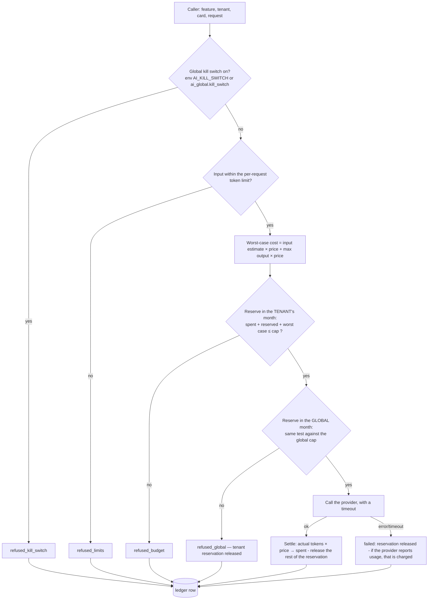

# 04 — AI gateway

> Phase 2 design. **Nothing in this document is built yet.** It is a proposal for Gate 1.
> Provider facts (models, prices, limits, terms) were read from the providers' own pages on **2026-10-03** and re-checked once; sources in `docs/DEPENDENCIES.md` §9. **No AI call has been made. No key exists.** Prices change; they are re-checked at Gate 2.

## In plain language

Every use of an AI model in LegacyAI goes through one small piece of code, the gateway. Nothing else in the system knows which company's model is behind it. The gateway has four jobs:

1. **Hide the provider.** The rest of the code asks for "generate text" or "turn text into a vector". Swapping the provider is a configuration change.
2. **Hold the purse.** Before any call it checks: is AI switched off globally? Has this company used up its monthly allowance? Has the whole system? If yes, the call is **not made**. Not "made and reported later" — not made.
3. **Write down every call.** Who, for which feature, which model, how many tokens, what it cost.
4. **Be fakeable.** In every automated test the "model" is a small deterministic program that costs nothing. CI never talks to a real provider.

Until you give a key at Gate 2, the fake is the only provider that exists.

## Interface

Two operations. No tool use, no web access, no file access for the model, no streaming in Phase 2.

```python
class Provider(Protocol):
    async def generate(self, req: GenerateRequest) -> GenerateResult: ...
    async def embed(self, req: EmbedRequest) -> EmbedResult: ...

GenerateRequest:  model, system (fixed instructions), data_blocks (untrusted text, labelled),
                  output_schema (JSON schema), max_output_tokens, prompt_version
GenerateResult:   parsed (validated against output_schema), input_tokens, output_tokens, stop_reason
EmbedRequest:     texts, kind ("document" | "query"), model
EmbedResult:      vectors (384 numbers each), input_tokens
```

Callers never build a provider request themselves and never see a raw response. The gateway is the only module that imports a provider's library; a lint rule enforces that.

**Instructions and data are separate arguments.** `system` comes only from a versioned prompt file. Documents, interview answers, questions and learner answers go in `data_blocks`, each wrapped and labelled as untrusted material. There is no code path that concatenates user text into the instruction part (`05`, prompt-injection controls).

**Output is always validated.** The model must return JSON matching `output_schema`. Anything else — wrong shape, extra fields, text around the JSON — is treated as a failed call (one retry, then an error to the caller), never passed on.

## Providers

| Name | When | What it is |
|---|---|---|
| `fake` | **default; the only one in CI and before Gate 2** | Deterministic. `generate` returns a scripted or rule-based answer derived from the input (e.g. "cite the first source and quote its first sentence"), and can be scripted per test to misbehave: invent a citation, obey an injected instruction, return broken JSON, time out. `embed` returns a vector computed from a hash of the normalised words, so similar texts get similar vectors and results are identical on every machine. Reports token counts from a fixed rule. Costs are computed with a made-up price so the budget code is exercised. |
| `local-embed` | embeddings, if you choose it (recommended) | A small open model run inside the Python service. No provider, no key, $0 per call. |
| one real chat provider | **only after Gate 2**, behind configuration | Selected by `AI_PROVIDER`; the key is read from the environment (Secret Manager in the cloud). If the variable is unset the service starts with `fake` and says so in its log and in `/health`. A real provider can never be selected in CI: the test configuration refuses to start if a real key is present. |

### Chat model — options verified on 2026-10-03

Prices are US dollars per million tokens, input / output. "Age" matters because of our 60-day maturity rule (`docs/decisions.md`, D2).

| Model (API id) | Price | Age | Passes 60-day rule | Notes |
|---|---|---|---|---|
| Claude Haiku 4.5 (`claude-haiku-4-5-20251001`) | $1 / $5 | 353 days | yes | Structured JSON output generally available. Its listed earliest retirement date is 2026-10-15; **no retirement has been announced**, and Anthropic's policy is at least 60 days' notice. |
| Claude Sonnet 5 (`claude-sonnet-5`) | $2 / $10 | 95 days | yes | mid-tier |
| Claude Sonnet 5.5 (`claude-sonnet-5-5`) | $2 / $10 | 5 days | **no** | too new |
| GPT-5.6 Luna (`gpt-5.6-luna`) | $0.20 / $1.20 | 86 days | yes | cheapest option that passes the rule. Figures read through a page summariser, not raw text — re-read at Gate 2. |
| GPT-6 Luna (`gpt-6-luna`) | $0.10 / $0.50 | 11 days | **no** | too new |
| Gemini 3.1 Flash-Lite (`gemini-3.1-flash-lite`) | $0.25 / $1.50 | 149 days | yes | shutdown announced for 2027-05-07 |
| Gemini 3.5 Flash-Lite (`gemini-3.5-flash-lite`) | $0.30 / $2.50 | 74 days | yes | |

Things that matter more than price for this product:

| | Anthropic | OpenAI | Google (Gemini API) |
|---|---|---|---|
| Trains on API data by default? | No | No | **Paid: no. Free tier: yes**, and people may read it — the free tier must never be used with customer data |
| Default retention | deleted within 30 days | abuse logs up to 30 days | 55 days (abuse logs) |
| **Hard monthly spending limit you can set yourself** | **Yes** — per workspace; requests are refused when reached. Needs a non-default workspace. | **Yes** (since 2026-07-22) — per project; "enforcement is not instantaneous" | Partly — project caps are marked experimental with ~10 minutes of overrun |
| Billing | prepaid credits; when they run out the API stops | prepaid credits, minimum $5 | prepaid, minimum $5 |
| Rate limits for a new account | 1,000 requests/min on the entry tier | 500 requests/min | not published |

**Recommendation for Gate 2 (your decision, open decision 1):** run the evaluation on **two** candidates under one small cap — Claude Haiku 4.5 and GPT-5.6 Luna — and choose with the measured numbers: citation validity, correct refusals, answer correctness, and cost per question. On price alone GPT-5.6 Luna is roughly five times cheaper; whether it is good enough at the cautious behaviour this product needs is exactly what the evaluation is for. *A caution about my own advice: I am an Anthropic model. Weigh my provider opinions accordingly and let the measurements decide.*

SDKs: `anthropic` 1.x is 44 days old and `openai` 3.x is 52 days old, so both fail the 60-day rule today. Both pass it before the end of October; the choice is recorded at Gate 2. Whichever is used is pinned exactly and lives only inside the gateway.

### Embeddings — options verified on 2026-10-03

Anthropic offers no embedding model and points to Voyage AI.

| Option | Cost | Size | For | Against |
|---|---|---|---|---|
| **Local: `BAAI/bge-small-en-v1.5` via `fastembed` 0.8.1** *(recommended)* | **$0** per call | 384 numbers; 67 MB model file; MIT licence | No second provider, no extra key, nothing leaves our service for embedding, no rate limits, identical results every time | English only. Weaker than hosted models (retrieval benchmark 51.7 vs. the mid-50s to 60s). Needs memory (no official figure — **ASSUMPTION** ~0.4 GB) → the AI service goes from 512 MiB to 1 GiB. Larger container image. Input limited to 512 tokens per chunk (our chunks are ~200). |
| Voyage `voyage-4-lite` | $0.02 per million tokens; first 200 M free | 256 / 512 / 1024 | Strong quality; small sizes supported | A second vendor and a seventh secret (≈ $0.06/month). By default Voyage **stores and may train on** data unless opted out, and opting out needs a payment method. |
| OpenAI `text-embedding-3-small` | $0.02 per million tokens | 1536, reducible | One vendor if OpenAI is also the chat provider | Sends all redacted text to the provider a second time |

**Recommendation: local** (open decision 2). It keeps the $0 rule, removes a vendor, and for a pilot of a few thousand chunks per company, keyword search plus a small embedding model is a reasonable start. The `embedding_model` column on every chunk and the `reembed` job make switching later a re-run, not a rebuild. The evaluation measures retrieval quality with this model and reports it.

## Money: caps, kill switch, ledger

All amounts are stored as **micro-dollars** (millionths of a dollar) in whole numbers. No floating point in money.

### Order of checks for every call



- **The cap is hard because of the reservation.** The test "is there room?" and the booking are one database statement (`UPDATE … SET reserved = reserved + $x WHERE spent + reserved + $x <= cap`). Two simultaneous calls cannot both squeeze under the cap; the second finds no room. The worst case is reserved **before** the call, so even a maximally long answer cannot push the month over.
- **Per-request caps:** `max_input_tokens` and `max_output_tokens` per plan and per feature (a quiz grading needs less than an answer). The output cap is also sent to the provider, so it cannot be exceeded.
- **Per-tenant monthly cap:** `ai_budgets.monthly_cap_micro_usd`, else the plan default. **Free plan: a stricter default.** You set the numbers at Gate 2 (open decision 7; suggested starting point: pilot $5 per company per month, free plan $1, global $20).
- **Global cap** across all companies: the last line of defence for *your* wallet.
- **Global kill switch:** two independent levers — an environment variable (takes effect on the next start) and a database flag set through an operator-only API route (takes effect on the next call). Either one stops every AI call. Embeddings with the local model are not affected (they cost nothing); hosted embeddings would be.
- **The provider's own hard limit** (set by you in their console at Gate 2) is a third, outer wall that does not depend on our code being right.
- **Input-token estimate:** before a call we do not know the exact count. The estimate is deliberately high (characters ÷ 3). After the call the provider's reported count is used. We do not ship a tokenizer library: the common one downloads files at run time and is built for one vendor's models.

### Ledger

One `ai_usage_ledger` row per call **including refused ones**, with tenant, card, feature, provider, model, prompt version, tokens, reserved and actual cost, the prices used, status, latency, request id. "Ledger completeness" is tested: the fake provider counts its calls, and the number of settled+failed rows must equal that count exactly; the sum of settled costs must equal `spent` in the period row.

Prices live in one versioned file (`ai_gateway/prices.yaml`) with the source URL and date for each model. A model with no price entry cannot be called.

### When the budget is exhausted — graceful, never silent

| Feature | What the user gets |
|---|---|
| Ask a question | `outcome: "budget_exhausted"` with the **search results without generated text**: the matching sources (titles and snippets they may read). Useful, costs nothing. |
| Interview | The answer just given is still saved (redacted, embedded locally). The next question comes from a fixed list for the topic instead of the model. The session is marked `stopped_budget` when the list is used up. |
| Candidate extraction, topic suggestions | queued; done when budget returns |
| Readiness test | multiple-choice grading is code and unaffected; open answers wait as a manual-grading task |
| Question generation | refused with a clear message |

Every refusal is an HTTP 200/202 with an explicit outcome or a problem response of type `ai-budget-exhausted` / `ai-disabled` — never a 500, never a hang, never a quiet success with a made-up answer. Owners and Admins can see the month's use and cap (`GET /v1/ai/budget`). An Owner is notified at 80 % and at 100 % (log-only notifier until email exists).

**Provider outage or timeout:** same paths as "budget exhausted", with outcome `ai_unavailable`. One retry on transient errors, with a short delay, inside the same reservation. No silent fallback to a different model.

## Prompts

- Each prompt is a file: `services/ai/app/prompts/<feature>/v<N>.md`, with a header (id, version, feature, output schema name). No prompt text in Python strings.
- A change is a **new version file**; old versions stay, so a ledger or answer-log row can always be traced to the exact wording used.
- A test loads every prompt file, checks the header, checks that the referenced output schema exists, and fails if two files claim the same id and version or if a prompt contains a slot for untrusted text inside the instruction section.
- Planned prompts: `answer`, `interview_question`, `item_extract`, `topic_extract`, `quiz_generate`, `quiz_grade`.

## Abuse limits (all AI paths)

| Limit | Default | Where |
|---|---|---|
| Questions per card | 30 per hour | Phase 1 rate limiter (PostgreSQL) |
| AI calls per tenant | 300 per hour | same |
| Question length | 1,000 characters | contract validation |
| Interview answer length | 4,000 characters | contract validation |
| Open test answer length | 4,000 characters | contract validation |
| Sources per prompt | 6 chunks | code |
| Output | per-feature token cap; URLs and images stripped from model text before it is returned | gateway |
| Refusals and validation failures | logged with reason codes | ledger + answer log |

## How this will be tested (fake provider only)

- **Hard stop:** set a cap that allows exactly N calls; the N+1th is refused, the provider call counter stays at N, the ledger shows one `refused_budget`.
- **Race:** 20 simultaneous calls with room for 5 → exactly 5 provider calls.
- **Worst-case reservation:** a call whose maximum output would cross the cap is refused even though a short answer would have fitted.
- **Kill switch:** environment and database lever each stop all calls; switching back restores them.
- **Global cap:** two tenants with room of their own are both stopped when the global cap is reached.
- **Ledger completeness** as described.
- **Settle and release:** after a call the reservation is zero and `spent` equals the ledger sum; after a failed call nothing is charged unless the provider reported usage.
- **Graceful paths:** each feature's budget-exhausted and provider-down behaviour.
- **No real provider in CI:** start-up refuses when a real key is present in the test environment; a test asserts the provider in use is `fake`.
- **Broken output:** malformed JSON, schema violations, extra text → handled, never returned.

## What this does not give you

- **Not a bill.** The ledger is our own count at published prices. The provider's invoice is the truth; Gate 2 compares the two on the evaluation run.
- **No protection against a wrong price file.** If a provider raises prices and the file is not updated, our caps undercount. The provider-side hard limit is the backstop.
- **The cap is per calendar month in UTC**, not a rolling window.
